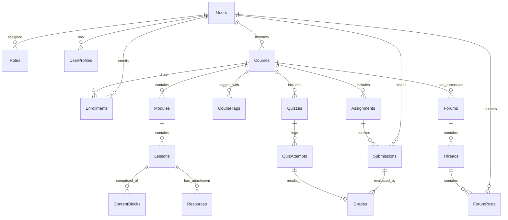
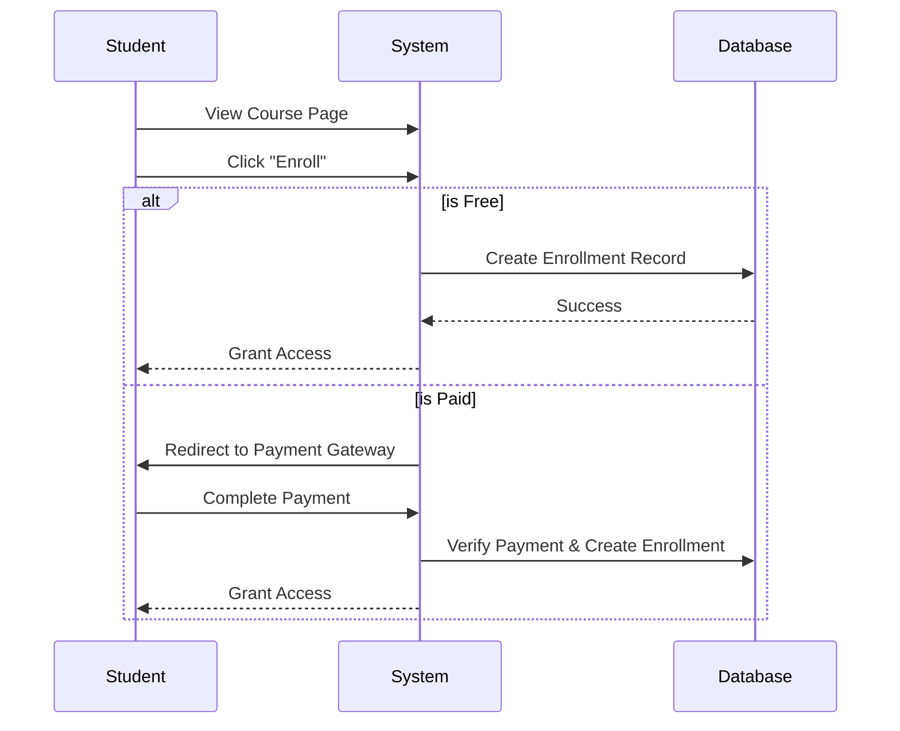
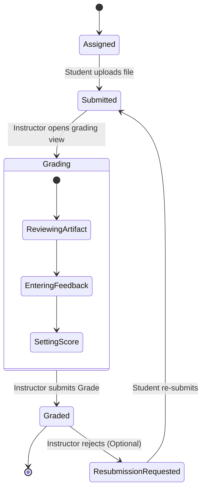

# Product Requirement Document: Enterprise Learning Management System (LMS)

## 1. Executive Summary
This document outlines the architectural and functional requirements for a production-ready, industry-grade Learning Management System (LMS). The system is designed to scale to thousands of users, supporting distinct roles (Admin, Teacher, Student) with strict access controls, robust content management, and comprehensive assessment capabilities.

## 2. User Roles & Access Control
The system implements a Role-Based Access Control (RBAC) model.

| Role | Description | Key Permissions |
| :--- | :--- | :--- |
| **Super Admin** | System owner | Full access to all settings, user management, global analytics, system configuration. |
| **School Admin** | Organizational admin | Manage users, courses, and reports within their specific organization/tenant. |
| **Teacher/Instructor** | Course creator | Create courses, grading, view student progress, manage course forums. |
| **Student** | Learner | Enroll in courses, consume content, submit assignments, take quizzes, view grades. |
| **Guest** | Unregistered user | View landing page, browse course catalog (public courses only). |

## 3. Entity Relationship Diagram (ERD)

## 4. Data Entities & Schemas

### 4.1 User Management

#### **Entity: User**
Core identity record for authentication and authorization.
- `id` (UUID, PK): Unique identifier.
- `email` (String, Unique): User email address.
- `password_hash` (String): Bcrypt/Argon2 hashed password.
- `role_id` (UUID, FK): Reference to Role entity.
- `is_active` (Boolean): Soft delete/ban flag.
- `created_at` (Timestamp): ISO 8601.
- `last_login` (Timestamp): Last successful auth.

#### **Entity: UserProfile**
Extended information for users.
- `user_id` (UUID, PK, FK): strict 1:1 relation with User.
- `first_name` (String): Legal first name.
- `last_name` (String): Legal last name.
- `bio` (Text, Optional): Instructor/Student bio.
- `avatar_url` (String, Optional): Link to profile image.
- `preferences` (JSON): Notification settings, theme, language.

### 4.2 Course Management

#### **Entity: Course**
The central container for learning material.
- `id` (UUID, PK): Unique identifier.
- `title` (String): Course name (max 150 chars).
- `slug` (String, Unique): URL-friendly identifier.
- `description` (Text): Rich text summary.
- `instructor_id` (UUID, FK): Owner/Creator.
- `status` (Enum): `DRAFT`, `PUBLISHED`, `ARCHIVED`.
- `enrollment_type` (Enum): `OPEN`, `INVITE_ONLY`, `PAID`.
- `price` (Decimal, Optional): For paid courses.
- `thumbnail_url` (String): Cover image.

#### **Entity: Module**
Logical grouping of lessons (e.g., "Week 1", "Chapter 2").
- `id` (UUID, PK): Unique identifier.
- `course_id` (UUID, FK): Parent course.
- `title` (String): Module name.
- `order_index` (Integer): Sequencing within course.
- `unlock_at` (Timestamp, Optional): Drip feed release date.

#### **Entity: Lesson**
Individual learning unit.
- `id` (UUID, PK): Unique identifier.
- `module_id` (UUID, FK): Parent module.
- `title` (String): Lesson name.
- `type` (Enum): `VIDEO`, `TEXT`, `QUIZ`, `ASSIGNMENT`.
- `content_payload` (JSON): Flexible structure for hosting video ID, HTML content, or reference IDs.
- `order_index` (Integer): Sequencing within module.
- `is_preview` (Boolean): Accessible without enrollment (for sales).

### 4.3 Assessment & Grading

#### **Entity: Assignment**
Task requiring student submission.
- `id` (UUID, PK): Unique identifier.
- `course_id` (UUID, FK): Parent course.
- `title` (String): Assignment name.
- `instructions` (Rich Text): Detailed requirements.
- `due_date` (Timestamp, Optional): Hard deadline.
- `max_points` (Integer): Score denominator.
- `allowed_file_types` (Array<String>): e.g., `['.pdf', '.docx']`.

#### **Entity: Submission**
Student work artifact.
- `id` (UUID, PK): Unique identifier.
- `assignment_id` (UUID, FK): Target assignment.
- `student_id` (UUID, FK): Submitter.
- `submitted_at` (Timestamp): Time of submission.
- `file_url` (String): Path to stored artifact.
- `status` (Enum): `SUBMITTED`, `GRADED`, `LATE`.

#### **Entity: Grade**
Evaluation record.
- `id` (UUID, PK): Unique identifier.
- `submission_id` (UUID, FK): Reference to work.
- `grader_id` (UUID, FK): Teacher who graded.
- `score` (Decimal): Earned points.
- `feedback` (Text): Qualitative feedback.
- `graded_at` (Timestamp): Time of grading.

### 4.4 Social & Communication

#### **Entity: Forum**
Discussion board context.
- `id` (UUID, PK): Unique identifier.
- `course_id` (UUID, FK): Context.
- `title` (String): Forum topic (e.g., "Course Q&A").

#### **Entity: Thread**
Individual conversation.
- `id` (UUID, PK): Unique identifier.
- `forum_id` (UUID, FK): Parent forum.
- `author_id` (UUID, FK): User who started thread.
- `title` (String): Subject.
- `created_at` (Timestamp).

#### **Entity: Post**
Reply or content.
- `id` (UUID, PK): Unique identifier.
- `thread_id` (UUID, FK): Parent thread.
- `author_id` (UUID, FK): Poster.
- `content` (Text): Markdown supported.
- `parent_post_id` (UUID, Optional, FK): For nested replies.

## 5. System Workflows

### 5.1 Student Enrollment Flow

### 5.2 Assignment Submission & Grading Flow

## 6. Functional Requirements

### 6.1 Authentication
- System must support Email/Password login.
- System should support OAuth2 (Google, Microsoft) for enterprise SSO.
- Password reset flow via secure email token.
- Session management via HTTP-Only Secure Cookies (JWT or Session ID).

### 6.2 Content Delivery
- **Video Player**: HLS streaming support with adaptive bitrate.
- **Progress Tracking**: Automatic checkmark when video finishes or lesson page is viewed > 30s.
- **Resources**: Ability to attach PDF, Slides, Zip files to any lesson.

### 6.3 Quizzes
- Support for Multiple Choice, True/False, and Short Answer.
- Auto-grading for objective questions.
- Question banking (reuse questions across quizzes).
- Time limits and "Force Submit" on timeout.

### 6.4 Notifications
- **Triggers**:
  - Assignment Graded.
  - New Course Announcement.
  - Reply to Forum Post.
  - Due Date Approathing (24h reminder).
- **Channels**: In-App Bell, Email Digest.

## 7. Non-Functional Requirements
- **Scalability**: Database designed to handle 1M+ rows in `AuditLogs` and `Submissions` utilizing partitioning.
- **Security**: All PII encrypted at rest. CSRF protection on all mutation endpoints.
- **Accessibility**: WCAG 2.1 AA compliant UI color contrast and ARIA labels.
- **Availability**: 99.9% Uptime SLA.
